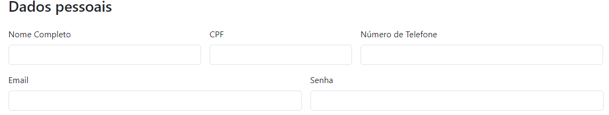
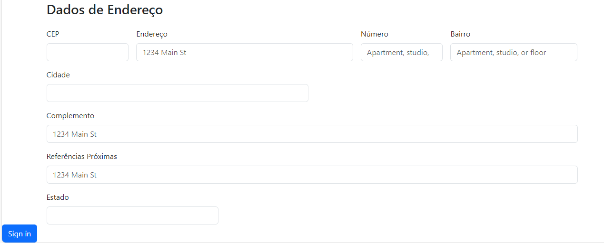

#   Formulário de Cadastro Ecommerce 📋
        
# Descrição do Projeto
Este é um repositório no GitHub que apresenta um projeto prático de um formulário de cadastro Ecommerce desenvolvido com HTML. O objetivo deste projeto é fornecer um exemplo de implatação do framework através do bootstrap.

<h1 align = "center">

Sites Utilizados

</h1>

* ``SHEIN``
><H3>CAMPOS IDENTIFICADOS NO CADASTRO DESSE SITE:</H3>

    NÚMERO DE CELULAR;

    E-MAIL E SENHA;

    NOME COMPLETO;

    CPF;
    
    CEP(Código Postal);

    LINHA DE ENDEREÇO;

    NÚMERO DE RESIDÊNCIA;

    ESTADO;

    PROVÍNCIA;

    CIDADE;BAIRRO.

* ``AMAZON``
 ><h3>CAMPOS IDENTIFICADOS NO CADASTRO DESSE SITE:</h3>

    NOME;

    NÚMERO DE CELULAR OU EMAIL;

    SENHA;

    SENHA NOVAMENTE;

    CEP;

    ENDEREÇO;

    NÚMERO DE RESIDÊNCIA;

    COMPLEMENTO(Opcional);

    BAIRRO;

    CIDADE;

    ESTADO.

* ``SHOPEE``
><h3>CAMPOS IDENTIFICADOS NESSE SITE</h3>

    NÚMERO DE TELEFONE;

    EMAIL;

    SENHA;

    CPF;

    PAÍS-ESTADO;

    RUA/BAIRRO;

    NÚMERO DA RESIDÊNCIA;

    COMPLEMENTO/REFERÊNCIAS PRÓXIMAS.

    

<h1 align = "center">

Campos no meu Site

</h1>

>DADOS PESSOAIS:

NOME COMPLETO;

CPF;

NÚMERO DE TELEFONE;

EMAIL;

SENHA;

>DADOS DE ENDEREÇO

CEP;

ENDEREÇO;

NÚMERO;

BAIRRO;

CIDADE;

ESTADO;

COMPLEMENTO;

REFERÊNCIAS PRÓXIMAS;

ESTADO;

# Ferramentas e tecnologias utilizadas 🛠️
>* ``HTML5``
>* ``BOOTSTRAP5``
>* ``Github`` 
>* ``Git``
>* ``Vscode``

##  🛠️Funcionalidades
>- Coleta de informações do usuário, como dados pessoais e dados de endereço
>- Campo para o usuário se cadastrar
>- Validação dos dados inseridos para garantir que sejam fornecidos corretamente.

## Como utilizar
>1. Abra o arquivo "form-cadecomemerce" em seu navegador web.
>2. Preencha os campos do formulário com suas informações pessoais e de endereço.
>3. Clique no botão "Sig in" para se cadastrar .

# Fontes Consultadas 
* [BOOTSRAP5](https://getbootstrap.com/docs/5.0/getting-started/introduction/)

# Autor
* [eduardoocosta](https://github.com/eduardoocosta)

